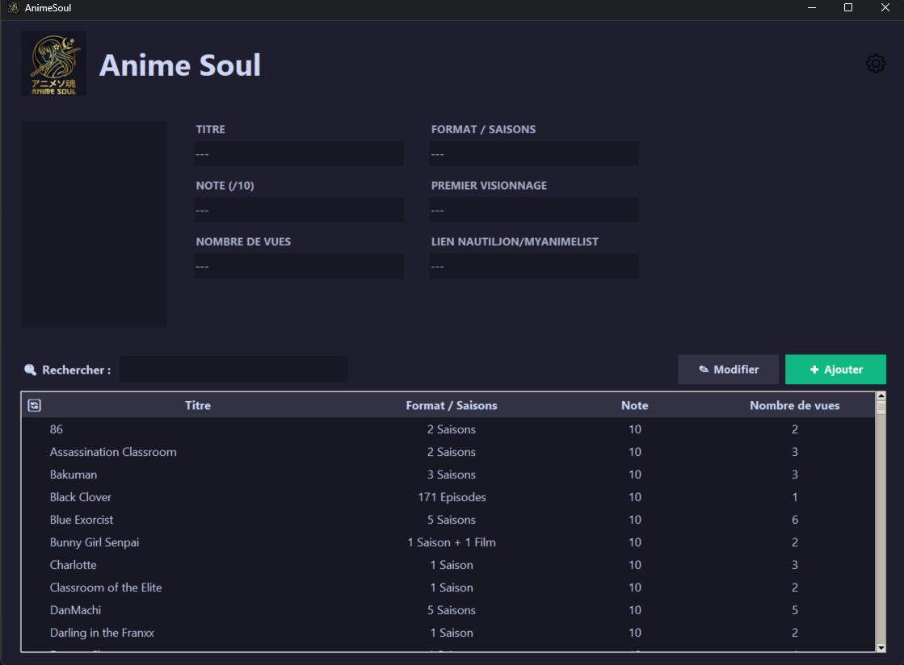

# AnimeSoul 🌸

<p align="center">
  
  
  
  
  
</p>

AnimeSoul is a modern **desktop application** built with Python and Tkinter that allows you to manage your personal anime library locally.  
Inspired by MyAnimeList, it provides a clean interface, secure local data management, and automatic poster fetching via the Jikan API.

---

## 📌 Table of Contents

- [About the Project](#-about-the-project)
- [Features](#-features)
- [Screenshots](#-screenshots)
- [Installation](#-installation)
- [Tech Stack](#-tech-stack)
- [Project Structure](#-project-structure)
- [Roadmap](#-roadmap)
- [License](#-license)

---

## 📖 About the Project

AnimeSoul is a **local MyAnimeList-style manager** designed for personal use.

All anime data is stored locally using SQLite3, ensuring:

- 🔒 Privacy
- ⚡ Fast performance
- 💾 Full offline access  

Internet access is only required for fetching anime posters through the Jikan API.

---

## ✨ Features

- ✅ **Full CRUD Management**  
  Add, edit, and delete anime from your collection.

- 🔎 **Smart Search**  
  Real-time filtering with text normalization (accent and case insensitive).

- 🖼️ **Automatic Poster Fetching**  
  Retrieves official posters via the Jikan API (MyAnimeList).

- 🎨 **Dark & Light Themes**  
  Fully customizable user interface themes.

- 🖥️ **Responsive UI**  
  High DPI awareness for Windows and immersive title bar support.

- 📁 **CSV Export**  
  Securely export your anime database.

---

## 📸 Screenshots

```markdown

```

---

## 🚀 Installation

### 1️⃣ Clone the repository

```bash
git clone https://github.com/your-username/animesoul.git
cd animesoul
```

### 2️⃣ Create a virtual environment

```bash
python -m venv venv
```

Activate it:

**Windows**
```bash
venv\Scripts\activate
```

**macOS / Linux**
```bash
source venv/bin/activate
```

### 3️⃣ Install dependencies

```bash
pip install -r requirements.txt
```

### 4️⃣ Run the application

```bash
python main.py
```

---

## 🛠️ Tech Stack

| Component | Technology |
|-----------|------------|
| Language | Python 3.10+ |
| GUI | Tkinter (Custom styling + Pillow) |
| Database | SQLite3 |
| Networking | Requests |
| External API | Jikan (MyAnimeList unofficial API) |

---

## 📂 Project Structure

```bash
animesoul/
│
├── main.py
├── database/
│   └── db_manager.py
├── ui/
│   └── app_interface.py
├── assets/
│   └── icons/
├── requirements.txt
└── README.md
```

---

## 🛣️ Roadmap

- [ ] Anime rating system
- [ ] Episode tracking
- [ ] Import/Export from MyAnimeList
- [ ] Statistics dashboard
- [ ] Cloud sync (optional future feature)

---

## 🤝 Contributing

Contributions are welcome!

1. Fork the repository  
2. Create your feature branch  
3. Commit your changes  
4. Push to the branch  
5. Open a Pull Request  

---

## 📜 License

This project is licensed under the MIT License.  
You are free to use, modify, and distribute it.

---

## ⭐ Support

If you like this project, consider giving it a star on GitHub!